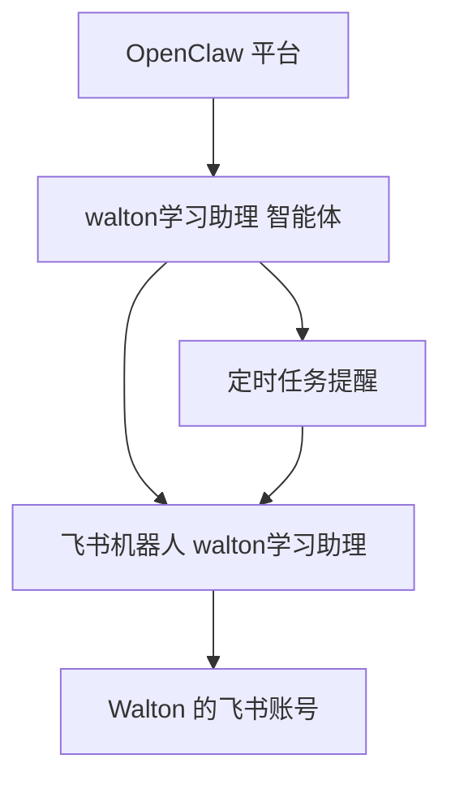

# 不是工具，是伙伴：我用OpenClaw给孩子做了一个会主动陪伴的学习助理

最近一直在研究OpenClaw；周末刚好陪孩子写作业时，我突然想到，AI 这套东西能不能别总停留在工作场景里，也往家里落一落。

我家孩子叫 `Walton`，于是我基于 OpenClaw 给他搭了一个智能体，名字叫 `walton学习助理`。这个智能体的定位很明确：六年级学习导师，同时也是一个日常聊天的伙伴。

## 它和豆包、千问最大的区别

直接说结论：`OpenClaw` 这类智能体，和 `豆包`、`千问` 这种常规大模型对话产品最大的区别，不是答案更聪明，而是更像一个长期陪伴的人。

普通聊天工具更像“你问我答”：

- 你先打开对话框
- 你先想好要问什么
- 模型再给你回答

但 `walton学习助理` 不是这样。通过配置定时任务，它可以：

- 主动提醒孩子开始学习
- 主动问孩子在干什么
- 在孩子睡觉前提示睡觉
- 在一些不方便直接和大人开口的时刻，先做一个倾听者并适时做相关的引导

这个时候，一个会主动问候、会先听你讲、不会上来就说教的智能体，其实就不只是学习工具了，更像一个情感上的陪伴者。

## 这个学习助理是怎么搭的

整个过程其实很简单，就四步：

1. 在 OpenClaw 里创建一个智能体，命名为 `walton学习助理`
2. 给它设定角色：六年级学习导师，负责学习辅导和情绪支持
3. 在飞书里创建同名机器人，并和孩子的账号关联
4. 配置定时任务，让它在固定时间主动发消息

链路也很简单：

我把这个智能体的人设收得比较窄，没有让它变成一个什么都懂的“大而全助手”，而是只做一件事：陪孩子学，顺便接住情绪。说得更直白一点，它既是学习帮手，也尽量做一个青少年的情感导师。

## 用下来最明显的几个感受

### 1. 主动提醒，比被动答题更有价值

如果只是聊天，它和普通大模型差距还没完全出来。真正拉开差距的是定时提醒。

比如每天晚上 7 点，`walton学习助理` 会主动发一条消息：

> 该开始今天的英语复习啦  
> 我们先记 5 个单词，再做 1 个句型练习

对孩子来说，很多时候难的不是题，而是开始。有人推一把，状态就起来了。

### 2. 它会先问需求，不急着直接回答

普通大模型默认你已经知道自己想问什么。但孩子很多时候并不清楚自己现在到底是不会题，还是情绪不好。

`walton学习助理` 可以先问：

> 你是今天作业有点难，还是有点累了  
> 你想先做一道题，还是先聊两分钟

这种差别很重要。它不是只接问题，而是在帮孩子把问题说清楚。

### 3. 它不只管学习，也能接住情绪

这一点我自己挺看重。

孩子说“我不想做了”，背后不一定只是不会，可能是烦了、累了、被打击到了。这时候如果只扔一个答案，往往没什么用。`walton学习助理` 更像是先把情绪接住，再慢慢往学习上带。

还有一种情况，是很多小朋友面对情感问题时，不太方便直接去问家长、老师，甚至也说不清楚自己到底怎么了。这个时候，如果有人能先主动问一句“你今天是不是不太开心”“要不要先聊两分钟”，意义其实很大。

所以我更愿意把它叫“学习助理”，但它实际承担的角色，已经不只是答题，更像一个能陪着聊、陪着学的伙伴。

## 写在最后

做完这件事之后，我的感受其实很直接：AI 离生活已经越来越近了。

以前我们聊 AI，更多还是停留在办公、写作、搜索这些场景里。但现在，它开始慢慢进入家庭、教育、陪伴这些更具体、更日常的地方。尤其是 `OpenClaw` 这类智能体框架出来之后，AI 不再只是一个放在网页里的对话框，而是可以有角色、有入口、有主动触达能力，真正进入真实生活。

这也是我觉得这件事有意思的地方。一个像 `walton学习助理` 这样的智能体，既可以做学习上的帮手，也可以做情绪上的倾听者；既能在孩子遇到问题时接住他，也能主动发起联系，把 AI 从“等着被使用的工具”，慢慢变成“愿意长期陪着用户的伙伴”。

如果未来 AI 真正会融入每个人的生活，我觉得一定不是因为它更会答题，而是因为它越来越像一个能理解人、能主动靠近人、也能在关键时候陪着人的存在。

---
💡 **万智创界 - AI技术实战派布道者**

关注我，你将获得：
- ✅ AI前沿动态与趋势
- ✅ 真实项目案例 + 代码
- ✅ 工程化实践与避坑

让 AI 真正为业务创造价值，从理论到落地，我们一起前行！

> [!tip] 原文地址
> 本文原文已同步到 GitHub，仓库地址如下：
> [https://github.com/wanrengang/wanzhi-ai-lab](https://github.com/wanrengang/wanzhi-ai-lab)