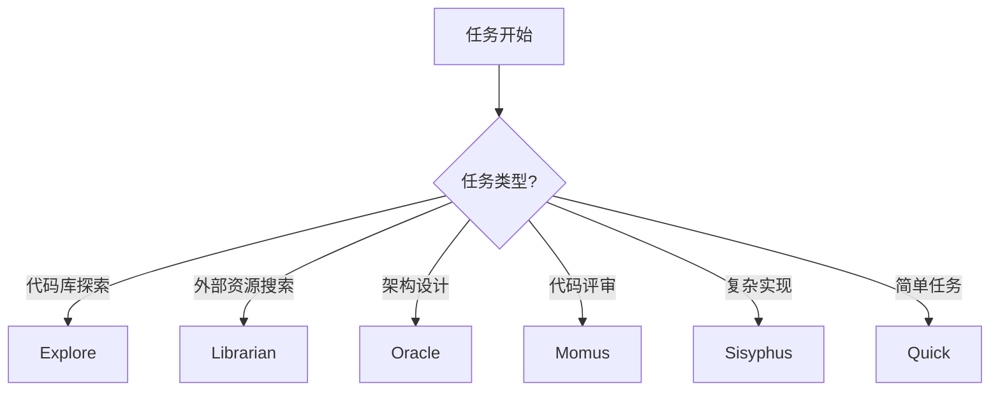
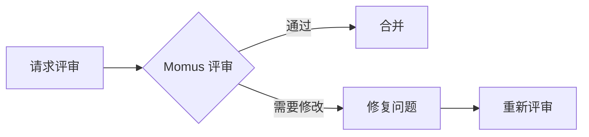

# OpenCode 知识图谱

> OpenCode 是一个强大的 AI 编程助手系统，通过多种专业化的子代理和技能，为用户提供高质量的编程支持。

## 核心架构

OpenCode 采用模块化的架构设计，核心组件包括：

- **主代理 (Sisyphus)**: 协调和执行复杂任务的中央代理
- **子代理系统**: 针对不同场景的专业化代理
- **技能库**: 预定义的专业技能集合
- **工具集成**: 与外部服务和本地工具的无缝集成

## 子代理类型

OpenCode 提供多种专业化的子代理，每个代理都有其特定用途：

| 子代理 | 类型 | 主要用途 | 复杂度 |
|--------|------|----------|--------|
| [[Sisyphus]] | 主要代理 | 任务协调和执行 | 高 |
| [[Oracle]] | 咨询代理 | 只读高IQ推理，架构和调试 | 高 |
| [[Metis]] | 规划代理 | 预规划分析，识别潜在问题 | 高 |
| [[Momus]] | 评审代理 | 工作计划和代码评审 | 中高 |
| [[Librarian]] | 研究代理 | 代码库分析和外部资源搜索 | 中 |
| [[Prometheus]] | 规划代理 | 计划模式执行 | 中 |
| [[Sisyphus-Junior]] | 执行代理 | 专注任务执行 | 中 |
| [[Explore]] | 探索代理 | 代码库上下文搜索 | 低 |
| [[General]] | 通用代理 | 通用任务执行 | 低 |

## 技能分类

### 开发工具技能

| 技能名称 | 描述 | 使用场景 |
|----------|------|----------|
| [[Git Master]] | Git 操作专家 | 提交历史、变基、合并、问题追踪 |
| [[Playwright]] | 浏览器自动化 | 测试、爬虫、网页交互 |
| [[Webapp Testing]] | Web 应用测试 | 本地应用测试和调试 |
| [[Dev Browser]] | 浏览器自动化 | 网页导航、表单填写、截图 |

### 设计技能

| 技能名称 | 描述 | 使用场景 |
|----------|------|----------|
| [[Frontend UI/UX]] | 前端设计 | 创建精美的用户界面 |
| [[Frontend Design]] | 前端界面设计 | 生产级前端组件开发 |
| [[UI/UX Pro Max]] | 高级 UI/UX 设计 | 可搜索的设计数据库 |
| [[Canvas Design]] | 画布设计 | PNG/PDF 视觉艺术创作 |
| [[Algorithmic Art]] | 算法艺术 | p5.js 创作生成艺术 |

### 文档技能

| 技能名称                  | 描述          | 使用场景          |
| --------------------- | ----------- | ------------- |
| [[Obsidian Markdown]] | Obsidian 语法 | Wiki 链接、嵌入、属性 |
| [[Obsidian Bases]]    | 数据库视图       | 表格视图、卡片视图     |
| [[JSON Canvas]]       | 画布文件        | 节点、边、连接的视觉组织  |
| [[Doc Coauthoring]]   | 文档协作        | 结构化文档编写流程     |

### 创作技能

| 技能名称 | 描述 | 使用场景 |
|----------|------|----------|
| [[Brand Guidelines]] | 品牌规范 | Anthropic 官方品牌应用 |
| [[Theme Factory]] | 主题工厂 | 为各种产物应用主题 |
| [[Web Artifacts Builder]] | Web 产物构建 | React/Tailwind/shadcn/ui 复杂组件 |
| [[PPT X]] | PPT 演示文稿 | 演示文稿创建和编辑 |
| [[PDF]] | PDF 处理 | PDF 提取、创建、合并 |
| [[XLSX]] | 电子表格 | 公式、格式化、数据分析 |
| [[Docx]] | Word 文档 | 追踪修改、批注、格式化 |

### 系统技能

| 技能名称 | 描述 | 使用场景 |
|----------|------|----------|
| [[MCP Builder]] | MCP 服务器构建 | 集成外部 API 和服务 |
| [[Skill Creator]] | 技能创建 | 创建新的专业技能 |
| [[Git Worktrees]] | Git 工作树 | 隔离工作区管理 |

### 流程技能

| 技能名称 | 描述 | 使用场景 |
|----------|------|----------|
| [[Brainstorming]] | 头脑风暴 | 创意构思和功能设计 |
| [[Writing Plans]] | 编写计划 | 多步骤任务规划 |
| [[Executing Plans]] | 执行计划 | 分阶段实现和检查点 |
| [[Subagent Driven Development]] | 子代理开发 | 独立任务并行执行 |
| [[Systematic Debugging]] | 系统调试 | Bug 定位和修复 |
| [[Test Driven Development]] | 测试驱动开发 | 先测试后实现 |
| [[Receiving Code Review]] | 接收代码评审 | 评审反馈处理 |
| [[Requesting Code Review]] | 请求代码评审 | 质量验证和合并 |
| [[Verification Before Completion]] | 完成前验证 | 最终检查和确认 |
| [[Finishing Development Branch]] | 完成开发分支 | PR 合并决策 |

### 媒体技能

| 技能名称 | 描述 | 使用场景 |
|----------|------|----------|
| [[Slack GIF Creator]] | GIF 动画创建 | Slack 优化的动画制作 |
| [[YT-DLP]] | 视频下载 | YouTube 和其他平台视频下载 |
| [[Multimodal Looker]] | 多媒体分析 | PDF、图片、图表分析 |

### 通信技能

| 技能名称 | 描述 | 使用场景 |
|----------|------|----------|
| [[Internal Comms]] | 内部沟通 | 公司内部通信格式 |

## 工具分类

### Web 工具

| 工具 | 功能 | 用途 |
|------|------|------|
| [[Web Search Exa]] | 网络搜索 | 快速网络信息获取 |
| [[Web Search Prime]] | 高级网络搜索 | 高质量网络内容搜索 |
| [[Web Reader]] | 网页阅读器 | URL 内容获取和转换 |
| [[GitHub App Search]] | GitHub 搜索 | 真实代码示例搜索 |

### 文档工具

| 工具 | 功能 | 用途 |
|------|------|------|
| [[Context7 Resolve]] | 库 ID 解析 | 文档库标识符解析 |
| [[Context7 Query]] | 文档查询 | 技术文档和代码示例获取 |
| [[ZRead Search Doc]] | 文档搜索 | GitHub 文档搜索 |
| [[ZRead Read File]] | 文件阅读 | GitHub 文件读取 |
| [[ZRead Repo Structure]] | 仓库结构 | GitHub 仓库结构获取 |

### 图像工具

| 工具 | 功能 | 用途 |
|------|------|------|
| [[UI to Artifact]] | UI 转产物 | 设计转代码/提示词/规格 |
| [[Extract Text Screenshot]] | OCR 提取 | 截图文字识别 |
| [[Diagnose Error]] | 错误诊断 | 错误信息分析和解决 |
| [[Understand Diagram]] | 图表理解 | 技术图表分析 |
| [[Analyze Data Viz]] | 数据可视化分析 | 图表洞察提取 |
| [[UI Diff Check]] | UI 对比检查 | 设计差异比较 |
| [[Analyze Image]] | 图像分析 | 通用图像理解 |
| [[Analyze Video]] | 视频分析 | 视频内容理解 |

### 浏览器 DevTools

| 工具 | 功能 | 用途 |
|------|------|------|
| [[Navigate Page]] | 页面导航 | URL、历史记录、刷新 |
| [[New Page]] | 新页面 | 新标签页创建 |
| [[Select Page]] | 页面选择 | 页面上下文切换 |
| [[Close Page]] | 关闭页面 | 页面管理 |
| [[Take Screenshot]] | 截图 | 页面或元素截图 |
| [[Take Snapshot]] | 快照 | 页面内容快照 |
| [[Click]] | 点击 | 元素点击操作 |
| [[Fill]] | 填充 | 表单输入 |
| [[Fill Form]] | 批量填充 | 多元素表单填写 |
| [[Hover]] | 悬停 | 悬停交互 |
| [[Drag]] | 拖拽 | 元素拖拽 |
| [[Press Key]] | 按键 | 键盘输入 |
| [[Upload File]] | 上传 | 文件上传 |
| [[Emulate]] | 模拟 | 设备、网络、位置模拟 |
| [[Resize Page]] | 调整大小 | 视口尺寸调整 |
| [[Handle Dialog]] | 处理对话框 | 弹窗处理 |
| [[Wait For]] | 等待 | 条件等待 |
| [[Evaluate Script]] | 执行脚本 | JavaScript 执行 |
| [[Console Messages]] | 控制台消息 | 日志查看 |
| [[Network Requests]] | 网络请求 | 请求查看和分析 |
| [[Performance Trace]] | 性能追踪 | 性能分析和 Core Web Vitals |

### 代码工具

| 工具 | 功能 | 用途 |
|------|------|------|
| [[LSP Definitions]] | 定义跳转 | 符号定义查找 |
| [[LSP References]] | 引用查找 | 符号使用查找 |
| [[LSP Symbols]] | 符号搜索 | 文件/工作区符号 |
| [[LSP Diagnostics]] | 诊断信息 | 错误、警告、提示 |
| [[LSP Rename]] | 重命名重构 | 符号重命名 |
| [[LSP Prepare Rename]] | 重命名准备 | 重命名验证 |
| [[AST Grep Search]] | AST 搜索 | 模式搜索 |
| [[AST Grep Replace]] | AST 替换 | 模式替换 |

### 文件工具

| 工具 | 功能 | 用途 |
|------|------|------|
| [[Read]] | 读取文件 | 文件内容读取 |
| [[Write]] | 写入文件 | 文件创建/覆盖 |
| [[Edit]] | 编辑文件 | 精确字符串替换 |
| [[Glob]] | 文件匹配 | 路径模式匹配 |
| [[Grep]] | 内容搜索 | 正则表达式搜索 |

### 设计工具 (Pencil)

| 工具 | 功能 | 用途 |
|------|------|------|
| [[Pencil Open]] | 打开文档 | 设计文档打开 |
| [[Pencil Batch Design]] | 批量设计 | 批量设计操作 |
| [[Pencil Batch Get]] | 批量获取 | 节点获取 |
| [[Pencil Get Editor]] | 编辑器状态 | 当前编辑状态 |
| [[Pencil Snapshot]] | 布局快照 | 布局结构分析 |
| [[Pencil Variables]] | 变量管理 | 主题和变量 |
| [[Pencil Style Guide]] | 风格指南 | 设计灵感 |
| [[Pencil Guidelines]] | 设计规则 | .pen 文件规则 |

## 委托模式

### 任务委托结构

```typescript
delegate_task({
  category: "visual-engineering",  // 或其他分类
  load_skills: ["playwright", "frontend-ui-ux"],  // 相关技能
  prompt: "任务描述",
  run_in_background: false  // 或 true
})
```

### 可用分类

| 分类 | 描述 | 适用场景 |
|------|------|----------|
| `visual-engineering` | 前端、UI/UX、设计 | 界面开发 |
| `ultrabrain` | 硬逻辑任务 | 复杂算法 |
| `deep` | 深度问题解决 | 需要深入理解的问题 |
| `artistry` | 创意解决方案 | 非标准问题 |
| `quick` | 简单任务 | 单文件修改 |
| `unspecified-low` | 低复杂度任务 | 简单任务 |
| `unspecified-high` | 高复杂度任务 | 复杂任务 |
| `writing` | 文档和写作 | 文档编写 |

## 使用流程

### 1. 任务评估

- 评估任务复杂度和类型
- 选择合适的代理和技能
- 确定是否需要多个代理并行

### 2. 代理选择



### 3. 技能组合

根据任务需求组合多个技能：

- **Web 开发**: `playwright` + `webapp-testing`
- **UI 设计**: `frontend-ui-ux` + `frontend-design`
- **文档编写**: `obsidian-markdown` + `doc-coauthoring`
- **代码质量**: `test-driven-development` + `receiving-code-review`
- **调试**: `systematic-debugging` + `verification-before-completion`

### 4. 执行和验证

- 使用合适的工具执行任务
- 通过诊断工具验证结果
- 进行必要的迭代优化

## 最佳实践

### 任务分解

1. **明确目标**: 定义具体的、可衡量的任务目标
2. **选择代理**: 根据任务类型选择最合适的子代理
3. **组合技能**: 合理组合技能以获得最佳效果
4. **分步执行**: 将复杂任务分解为可管理的步骤
5. **持续验证**: 每个步骤后进行验证

### 技能使用

- **先评估后使用**: 在使用技能前评估其适用性
- **组合使用**: 合理组合多个技能
- **避免重复**: 不要在同一任务中重复使用相似技能
- **及时清理**: 完成后清理不必要的资源

### 工具选择

| 场景 | 推荐工具 |
|------|----------|
| 代码搜索 | `grep`, `ast_grep_search`, `explore` |
| 文件操作 | `read`, `edit`, `write` |
| Web 搜索 | `web-search-prime`, `grep_app_searchGitHub` |
| 浏览器操作 | `chrome-devtools_*` 系列 |
| 设计工作 | `pencil_*` 系列 |
| 文档处理 | `pdf`, `xlsx`, `docx` |

## 常见模式

### 探索-实现模式


### 评审模式



### 调试模式


## 相关资源

### 内部链接

- [[AI 助手]]
- [[编程工具]]
- [[知识管理]]
- [[工作流程]]

### 外部资源

- [OpenCode 官方文档]()
- [GitHub 仓库]()
- [示例项目]()

## 标签索引

#OpenCode #AI #代理 #技能 #工具 #编程 #开发

---

*最后更新: 2025-01-20*
